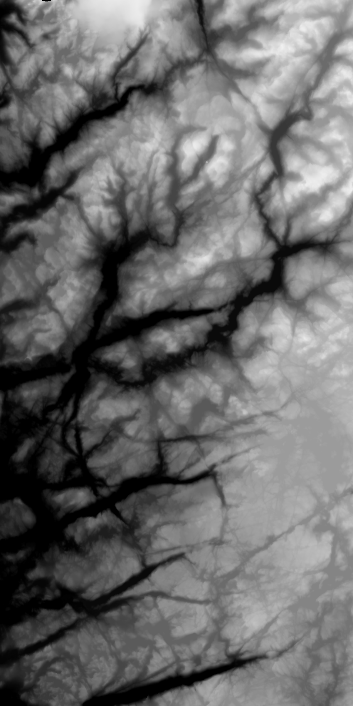
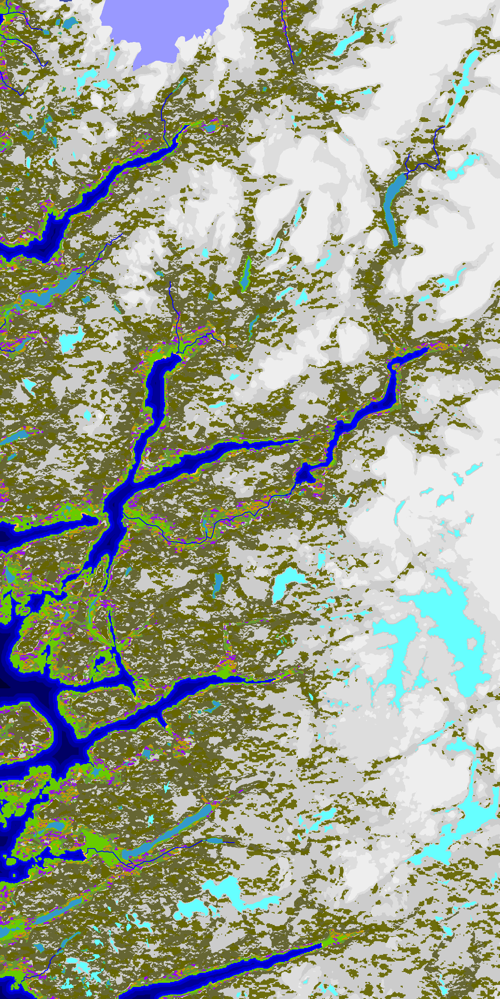

# minecraft-terrain-map-2011

Behold, code from 2011! 🤢

It was the second semester of university, when I discovered [Minecraft]. And
python I guess...

What I really wanted was a script that could create maps from real
terrain data. Specifically, I wanted to see if I could recreate the fjords of
Rogaland, Norway.

## How did it work?

The maps are generated by a single script that goes through each pixel in an
image and renders the terrain based on some rules.

Digital Elevation Models (DEMs) were easily obtainable from ASTER, which is
where I think the PNGs in `/pymcgenerator/maps/E*.png` come from. For example:

The "terrain" data (water, grass, rock, data) was composed using an image
editor along with the terrain data. In other words, if the elevation was 0, I
assumed it was water. I also overlapped some lake data either from
[OpenStreetMap] or [NaturalEarthData]. I can't remember because it's been so
long ago... (Apologies OSM contributors!)

The colours correspond to colour definitions which can be found in
`/pymcgenerator/info/*.txt`

## Any screenshots of the world?

Apparently not... But after I've refactored this code maybe I can probably
recreate this! Give me time...

## Installation

If I recall correctly, the library "[pymclevel]" needs to be located...

Some of the hardcoded file-paths in this source code will need to be fixed.

## Usage

From reading the source code, it seems there are two scripts:

### `generateMapTerrain.py`

`python generateMapTerrain.py` will generate a map. The code claims I wrote a
readme.txt file... but I think I copy-pasted that comment 🤦. Thankfully the
source code seems to be mostly self-explanatory. The idea is that passes in:

1. Minecraft World Name
2. An `eart.txt` file, which specifies min-elevation, max elevation, bedrock.
3. An `tart.txt` file, which specifies what the colours mean
4. An `d.txt` file, which adds "deposits" (coal, red-stone, gold, etc.) under
   ground.
5. The `E.*.png` file, which is the elevation map
6. The `T.*.png` file, which is the terrain map
7. The X, Y coordinates of where the data should be rendered.

Then it'll run for a long time... like, a few hours. I was in uni, so I had
_plenty_ of time on my hands.

### `emptyChunk.py`

`python emptyChunk.py` will delete all chunk data in a Minecraft save file. Not
sure why I would need such a script, but apparently it exists.

[Minecraft]: https://minecraft.net
[OpenStreetMap]: https://www.openstreetmap.org
[NaturalEarthData]: https://www.naturalearthdata.com
[pymclevel]: https://github.com/Podshot/MCEdit-Unified/tree/master/pymclevel
