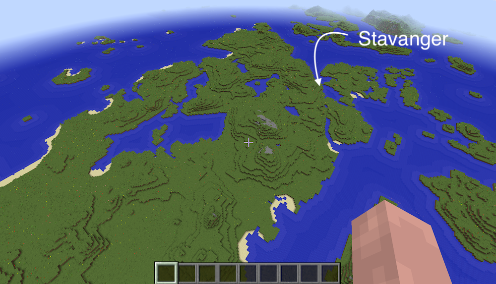
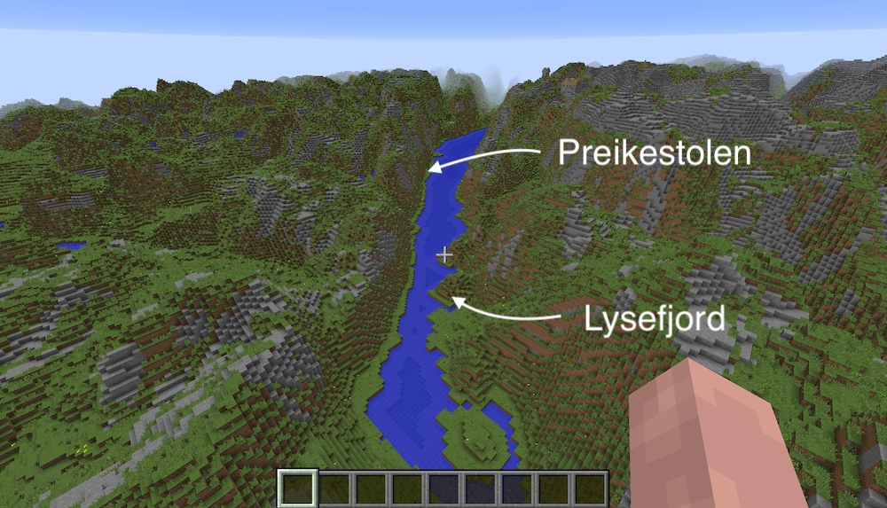
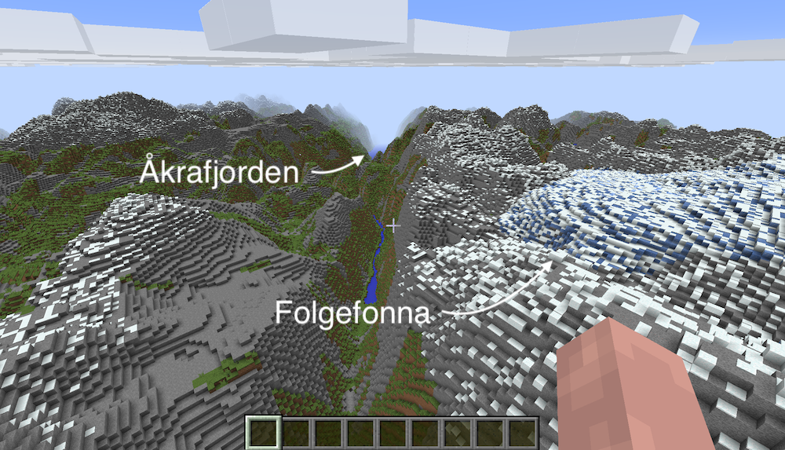
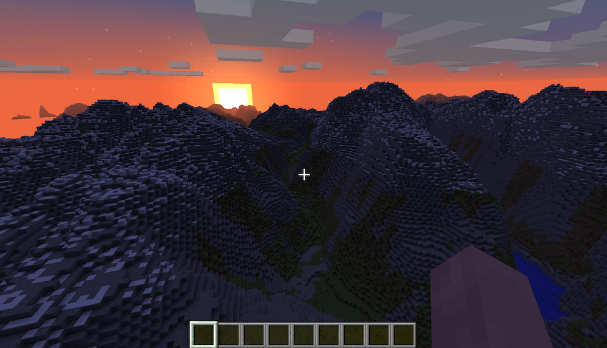
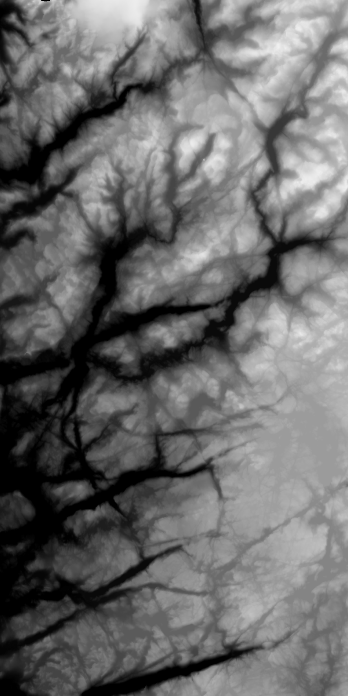
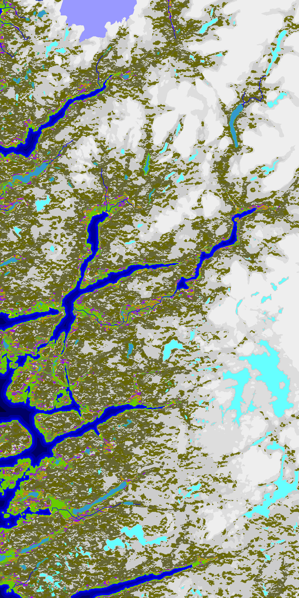

# minecraft-terrain-map-2011

Behold, code from 2011! 🤢 It was the second semester of university, when I
discovered [Minecraft] and python. My coding style was atrocious back then...

What I really wanted at the time was a script that could create maps from real
terrain data. Specifically, I wanted to see if I could recreate the fjords of
[Rogaland, Norway][Rogaland]. Below are some examples!

A birds eye view of [Stavanger]

[Preikestolen] / Lysefjord (It's too small to resolve in the elevation data 😅)

[Folgefonna] glacier to the right

Sunset in the mountains

## How did it work?

The maps are generated by a single script that goes through each pixel in an
image and renders the terrain based on some rules.

Digital Elevation Models (DEMs) were easily obtainable from [SRTM], which is
where I think the PNGs in `maps/E*.png` come from. For example:

The "terrain" data (water, grass, rock, data) was composed using photoshop
along with the terrain data. For example other words, if the elevation was 0, I
assumed it was water. I also overlapped some lake/glacier data either from
[OpenStreetMap] or [NaturalEarthData]. I can't remember because it's been so
long ago... (Apologies OSM contributors!)

The colours correspond to colour definitions which can be found in
`info/*.txt`

## Installation

Can't be bothered to write instructions for this, but you'll need:

* Python 2.7, because the code is old
* Install the requirements in requirements.txt using pip
* run `make install_mcedit`
* Change the filepath of the world in the `Makefile` to point to _your_
  Minecraft world
* run `make generate_example_map`

## Usage

There are two scripts:

### `generateMapTerrain.py`

`python generateMapTerrain.py` will generate a map. The code claims I wrote a
readme.txt file... but I think I copy-pasted that comment 🤦. Thankfully the
source code seems to be mostly self-explanatory. The idea is that passes in:

1. Minecraft World Name
2. An `e.txt` file, which specifies min-elevation, max elevation, bedrock.
3. An `t.txt` file, which specifies what the colours mean
4. An `d.txt` file, which adds "deposits" (coal, red-stone, gold, etc.) under
   ground.
5. The `E.*.png` file, which is the elevation map
6. The `T.*.png` file, which is the terrain map
7. The X, Y coordinates of where the data should be rendered.

Then it'll run for a long time... like, a few hours. I was in uni, so I had
_plenty_ of time on my hands.

### `emptyChunk.py`

`python emptyChunk.py` will delete all chunk data in a Minecraft save file. Not
sure why I would need such a script, but apparently it exists. I've not
bothered to fix it, so it probably does not work without fixing some of the
import statements.

[Minecraft]: https://minecraft.net
[Rogaland]: https://en.wikipedia.org/wiki/Rogaland
[Stavanger]: https://en.wikipedia.org/wiki/Stavanger
[Preikestolen]: https://en.wikipedia.org/wiki/Preikestolen
[Folgefonna]: https://en.wikipedia.org/wiki/Folgefonna
[SRTM]: https://en.wikipedia.org/wiki/Shuttle_Radar_Topography_Mission
[OpenStreetMap]: https://www.openstreetmap.org
[NaturalEarthData]: https://www.naturalearthdata.com
[pymclevel]: https://github.com/Podshot/MCEdit-Unified/tree/master/pymclevel
